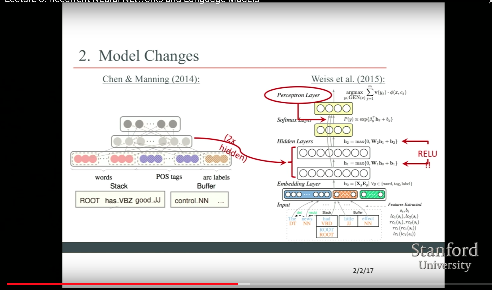

# Language Modeling
#### 1. _Reference_  
* [Great RNN Blog](http://karpathy.github.io/2015/05/21/rnn-effectiveness/)
* [Latex Math syntax](http://csrgxtu.github.io/2015/03/20/Writing-Mathematic-Fomulars-in-Markdown/)
* [Example of Latex Math symbols](https://math.meta.stackexchange.com/questions/5020/mathjax-basic-tutorial-and-quick-reference)
* [Markdown Mate](https://mdp.tylingsoft.com/#markdown-mate)

#### 2. _Models_  
1. SyntexNext By Google
2.Trick for exploding gradient: clipping trick
>**Algorithm**: 
>

> **Language Model**: predict the probability of observing
 sentence  
> $$P(w_1, ..., w_m) = \prod_{i=1}^{m}(P(w_i)|w_1, ...,w_i-1)$$  
> It's a **scoring** problem, _**RNN**_ can capture long-term dependencies  
> $$Loss Function = Entropy $$
#### main method
* **1. Tokenize Text**
* **2. Remove infrequent words**  
  >replace all not known words to _UNKNOWN_TOKEN_
* **3. prepend special start and end tokens**
  >1. prepend as special _SENDTENCE_START_  
  >2. append a special __SENTENCE_END_

  Given the first token _SENDTENCE_START_， what's the likely next word
* **4. building training data matrices**
  >The input to our Recurrent Neural Networks are vectors, not strings. So we create a mapping between words and indices, index_to_word, and word_to_index. For example,  the word “friendly” may be at index 2001. A training example x may look like [0, 179, 341, 416], where 0 corresponds to SENTENCE_START. The corresponding label y would be [179, 341, 416, 1]. Remember that our goal is to predict the next word, so y is just the x vector shifted by one position with the last element being the SENTENCE_END token. In other words, the correct prediction for word 179 above would be 341, the actual next word

  ```python
  vocabulary_size = 8000
  unknown_token = "UNKNOWN_TOKEN"
  sentence_start_token = "SENTENCE_START"
  sentence_end_token = "SENTENCE_END"

  # Read the data and append SENTENCE_START and SENTENCE_END tokens
  print "Reading CSV file..."
  with open('data/reddit-comments-2015-08.csv', 'rb') as f:
      reader = csv.reader(f, skipinitialspace=True)
      reader.next()
      # Split full comments into sentences
      sentences = itertools.chain(*[nltk.sent_tokenize(x[0].decode('utf-8').lower()) for x in reader])
      # Append SENTENCE_START and SENTENCE_END
      sentences = ["%s %s %s" % (sentence_start_token, x, sentence_end_token) for x in sentences]
  print "Parsed %d sentences." % (len(sentences))

  # Tokenize the sentences into words
  tokenized_sentences = [nltk.word_tokenize(sent) for sent in sentences]

  # Count the word frequencies
  word_freq = nltk.FreqDist(itertools.chain(*tokenized_sentences))
  print "Found %d unique words tokens." % len(word_freq.items())

  # Get the most common words and build index_to_word and word_to_index vectors
  vocab = word_freq.most_common(vocabulary_size-1)
  index_to_word = [x[0] for x in vocab]
  index_to_word.append(unknown_token)
  word_to_index = dict([(w,i) for i,w in enumerate(index_to_word)])

  print "Using vocabulary size %d." % vocabulary_size
  print "The least frequent word in our vocabulary is '%s' and appeared %d times." % (vocab[-1][0], vocab[-1][1])

  # Replace all words not in our vocabulary with the unknown token
  for i, sent in enumerate(tokenized_sentences):
      tokenized_sentences[i] = [w if w in word_to_index else unknown_token for w in sent]

  print "\nExample sentence: '%s'" % sentences[0]
  print "\nExample sentence after Pre-processing: '%s'" % tokenized_sentences[0]

  # Create the training data
  X_train = np.asarray([[word_to_index[w] for w in sent[:-1]] for sent in tokenized_sentences])
  y_train = np.asarray([[word_to_index[w] for w in sent[1:]] for sent in tokenized_sentences])
  ```
